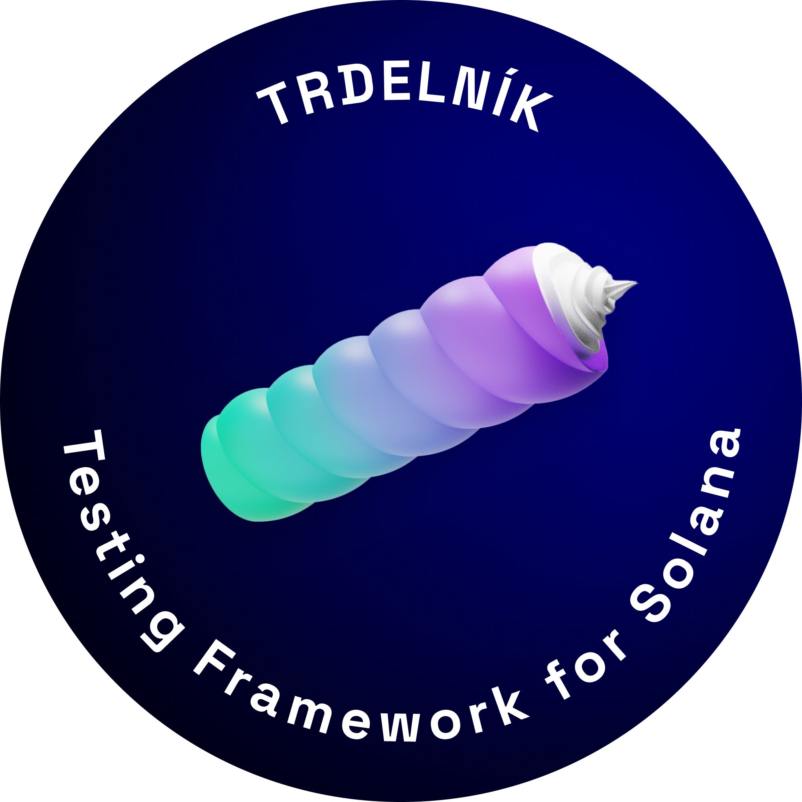

 
## **Trdelnik** is a Rust based testing framework for Solana programs written in [Anchor](https://project-serum.github.io/anchor/getting-started/introduction.html) 
 
  
 
 #
  

   
    

 
**developed by [Ackee Blockchain](https://ackeeblockchain.com)**

 #
 

- [📌 Core Features](#-core-features)

- [💾 How to Install](#-how-to-install)

- [📆 Roadmap](#-roadmap)

- [🚀 Contribution](#-contribution)

- [🍼 Getting Help](#-getting-help)

# 📌 Core Features

- ### Trdelnik console

Trdelnik console will compile and deploy an Anchor program, launch a local cluster 
and give developers a command prompt to interact with the program.

- ### Trdelnik client

Trdelnik client wraps Anchor client so there is no need to write code in Javascript.
Developers can build and deploy an Anchor program to a local cluster and run a test suite against it in one Trdelnik command.

- ### Trdelnik fuzz
    
Trdelnik fuzz is a tool for automating the testing process. It generates automatically random data as inputs, so developers don't have to write them themselves.

- ### Trdelnik explorer

Trdelnik explorer allows developers to simulate Solana transactions against a
local cluster and examine changes of a local ledger.

# 💾 How to Install

Lorem ipsum dolor sit amet, consectetuer adipiscing elit. Cras elementum. Nullam sapien sem, ornare ac, nonummy non, lobortis a enim. Fusce dui leo, imperdiet in, aliquam sit amet, feugiat eu, orci. Sed convallis magna eu sem. Neque porro quisquam est, qui dolorem ipsum quia dolor sit amet, consectetur, adipisci velit, sed quia non numquam eius modi tempora incidunt ut labore et dolore magnam aliquam quaerat voluptatem. Quisque porta. Curabitur sagittis hendrerit ante. Ut tempus purus at lorem. Etiam neque. Pellentesque ipsum. Donec quis nibh at felis congue commodo. Cum sociis natoque penatibus et magnis dis parturient montes, nascetur ridiculus mus. Curabitur ligula sapien, pulvinar a vestibulum quis, facilisis vel sapien. Aliquam in lorem sit amet leo accumsan lacinia. Integer pellentesque quam vel velit. Maecenas aliquet accumsan leo.

# 📆 Roadmap  

✅ - Feb/22
Trdelnik announcement at Prague Hacker House
Trdelnik client available for testing

- [ ]  Q2/22
Trdelnik console and explorer available

- [ ]  Q3/22
Trdelnik fuzz available

# 🍼 Getting Help 

Lorem ipsum dolor sit amet, consectetuer adipiscing elit. Cras elementum. Nullam sapien sem, ornare ac, nonummy non, lobortis a enim. Fusce dui leo, imperdiet in, aliquam sit amet, feugiat eu, orci. Sed convallis magna eu sem. Neque porro quisquam est, qui dolorem ipsum quia dolor sit amet, consectetur, adipisci velit, sed quia non numquam eius modi tempora incidunt ut labore et dolore magnam aliquam quaerat voluptatem. Quisque porta. Curabitur sagittis hendrerit ante. Ut tempus purus at lorem. Etiam neque. Pellentesque ipsum. Donec quis nibh at felis congue commodo. Cum sociis natoque penatibus et magnis dis parturient montes, nascetur ridiculus mus. Curabitur ligula sapien, pulvinar a vestibulum quis, facilisis vel sapien. Aliquam in lorem sit amet leo accumsan lacinia. Integer pellentesque quam vel velit. Maecenas aliquet accumsan leo.

# 🚀 Contribution

Thank you for your interest in contributing to Trdelnik! All contributions are welcome no
matter how big or small. This includes (but is not limited to) filing issues,
adding documentation, fixing bugs, creating examples, and implementing features.

If you'd like to contribute, please claim an issue by commenting, forking, and
opening a pull request, even if empty. This allows the maintainers to track who
is working on what issue as to not overlap work. 

If you're considering larger changes or self motivated features, please file an issue
and engage with the maintainers in [Discord](https://discord.com/invite/h3zeeCbHYT).

# License
This project is licensed under the [MIT license](https://github.com/Ackee-Blockchain/trdelnik/blob/master/LICENSE).
