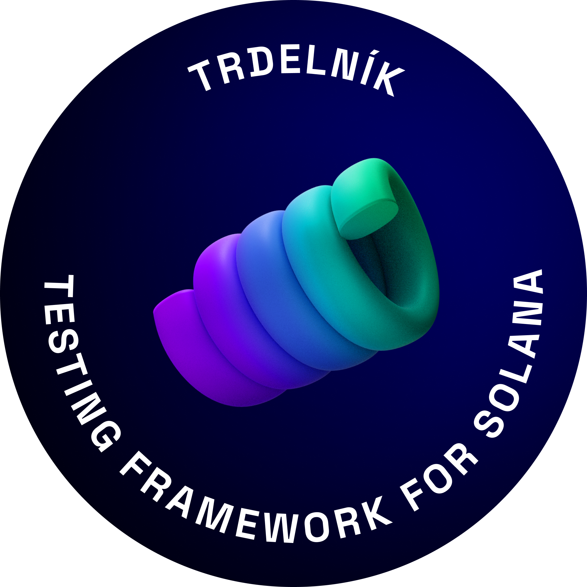

<div align="center">



<!-- About -->

# Trdelník

  <p align="center">
   <a href="https://discord.com/invite/h3zeeCbHYT">
    
   </a>
    </p>

developed by [Ackee Blockchain](https://ackeeblockchain.com)

<div align="left">

Trdelník is Rust based testing framework providing several convenient developer tools for testing Solana programs written in [Anchor](https://github.com/project-serum/anchor).

- _Trdelnik client_ - build and deploy an Anchor program to a local cluster and run a test suite against it.
- _Trdelnik console_ - built-in console to give developers a command prompt for quick program interaction.
- _Trdelnik fuzz_ - property-based and stateful testing.
- _Trdelnik explorer_ - exploring a ledger changes.

</div>



#

</div>

<!-- Dependencies -->

## **Dependencies**

- Install [Solana tool suite](https://docs.solana.com/cli/install-solana-cli-tools) (`stable` release)
- Install [Rust](https://www.rust-lang.org/tools/install) (`nightly` release)
- Install [Anchor](https://book.anchor-lang.com/chapter_2/installation.html)

<!-- Installation -->

## **Installation**
Currently only by cloning the repo and building from source. See [Examples](#examples)

<!-- Examples -->

## **Examples**
Here's a test of [turnstile program](examples/turnstile/programs/turnstile/src/lib.rs).Currently there are few compulsory step you need to follow:

- Import of the `trdelnik_client` crate.
- Create an empty test and annotate it with the `trdelnik_test` macro (as shown bellow).
- Run `makers trdelnik test` in order to generate a `program_client` crate (containing an auto generated code for easy invocation of instructions of your program)
- Add `program_client` crate into your `Cargo.toml` and import it to the test (as shown bellow).
- Now you can easilly invoke instructions of your program and do whatever you want in your test.
- After you are finished with your tests run `makers trdelnik test` and check the results.
```rust
// ...
use program_client::turnstile_instruction;
use trdelnik_client::*;

#[trdelnik_test]
async fn test_happy_path() {
    // create a test fixture
    let mut fixture = Fixture {
        client: Client::new(system_keypair(0)),
        program: program_keypair(1),
        state: keypair(42),
    };
    // deploy a tested program
    fixture.deploy().await?;

    // init instruction call
    turnstile_instruction::initialize(
        &fixture.client,
        fixture.state.pubkey(),
        fixture.client.payer().pubkey(),
        System::id(),
        Some(fixture.state.clone()),
    )
    .await?;
    // coin instruction call
    turnstile_instruction::coin(
        &fixture.client,
        "dummy_string".to_owned(),
        fixture.state.pubkey(),
        None,
    )
    .await?;
    // push instruction call
    turnstile_instruction::push(&fixture.client, fixture.state.pubkey(), None).await?;

    // check the test result
    let state = fixture.get_state().await?;

    // after pushing the turnstile should be locked
    assert_eq!(state.locked, true);
    // the last push was successfull
    assert_eq!(state.res, true);
}

// ...
```
For more details, see the [complete test](examples/turnstile/programs/tests/) implementation.
<!-- Roadmap -->

## **Roadmap**

- [x] Q1/22 Trdelnik announcement at Prague Hacker House
  - [x] Trdelnik client available for testing
- [ ] Q2/22 Trdelnik explorer available
- [ ] Q3/22 Trdelnik fuzz available
- [ ] Q3/22 Trdelnik console available

<!-- Contribution -->

## **Contribution**

Thank you for your interest in contributing to Trdelník! Please see the [CONTRIBUTING.md](./CONTRIBUTING.md) to learn how.

<!-- License -->

## **License**

This project is licensed under the [MIT license](https://github.com/Ackee-Blockchain/trdelnik/blob/master/LICENSE).
