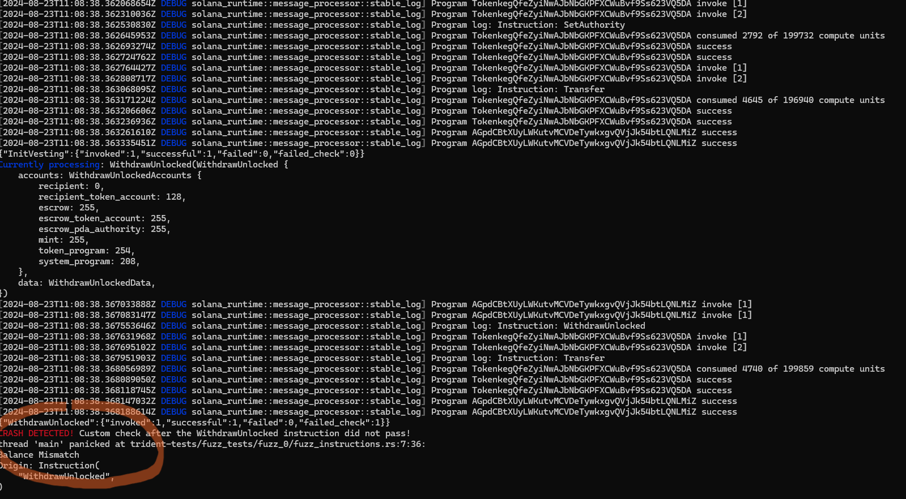

---
hide:
  - navigation
---

---


## trident init

- This command Initializes Trident Workspace and generates new Fuzz Test Template.

- The command will generate the following folder structure:
```bash
project-root
├── trident-tests
│   ├── fuzz_tests # fuzz tests folder
│   │   ├── fuzz_0 # particular fuzz test
│   │   │   ├── test_fuzz.rs # the binary target of your fuzz test
│   │   │   └── fuzz_instructions.rs # the definition of your fuzz test
│   │   ├── fuzz_1
│   │   ├── fuzz_X # possible multiple fuzz tests
│   │   ├── fuzzing # compilations and crashes folder
│   │   └── Cargo.toml
├── Trident.toml
└── ...
```

---

## trident fuzz

- This command behavior depends on the subcommands.

### trident fuzz run-afl

- Run AFL on the specified Fuzz Target (i.e. the Fuzz Template, for example fuzz_0).

#### Output

TBD

### trident fuzz run-hfuzz

- Run Honggfuzz on the specified Fuzz Target (i.e. the Fuzz Template, for example fuzz_0).

#### Output

!!! important

    The output provided by Honggfuzz is as follows:

    1. Number of Fuzzing Iterations.
    2. Feedback Driven Mode = Honggfuzz generates data based on the feedback (i.e. feedback based on Coverage progress).
    3. Average Iterations per second.
    4. Number of crashes it found (**panics** or failed **invariant checks**).


```bash
------------------------[  0 days 00 hrs 00 mins 01 secs ]----------------------
  Iterations : 688 (out of: 1000 [68%]) # -- 1. --
  Mode [3/3] : Feedback Driven Mode # -- 2. --
      Target : trident-tests/fuzz_tests/fuzzing.....wn-linux-gnu/release/fuzz_0
     Threads : 16, CPUs: 32, CPU%: 1262% [39%/CPU]
       Speed : 680/sec [avg: 688] # -- 3. --
     Crashes : 1 [unique: 1, blocklist: 0, verified: 0] # -- 4. --
    Timeouts : 0 [10 sec]
 Corpus Size : 98, max: 1048576 bytes, init: 0 files
  Cov Update : 0 days 00 hrs 00 mins 00 secs ago
    Coverage : edge: 10345/882951 [1%] pc: 163 cmp: 622547
---------------------------------- [ LOGS ] ------------------/ honggfuzz 2.6 /-
```

### trident fuzz debug-afl

- Run AFL debug on the specified Fuzz Target (i.e. the Fuzz Template, for example fuzz_0), with specified crash file, to see where the crash file found an issue.

#### Output

TBD

### trident fuzz debug-hfuzz

- Run Honggfuzz debug on the specified Fuzz Target (i.e. the Fuzz Template, for example fuzz_0), with specified crash file, to see where the crash file found an issue.


#### Output

!!! important

    The debug output is at current development stage really verbose and contains lldb parts. We are working on improving this experience. In the picture below you can see an example of provided debug output.

    1. Series of Transaction Logs
    2. Structures of data send within the Instructions
    3. **Panic** or **Crash**, based on if the Fuzzing panicked within the Solana Program or Invariant Check failed.




### trident fuzz add

- Adds new Fuzz Test Template.

---

## trident clean

- Calls `anchor clean` and cleans targets created by the underlying Honggfuzz and AFL. Crashfiles and Fuzzing Inputs are preserved.
