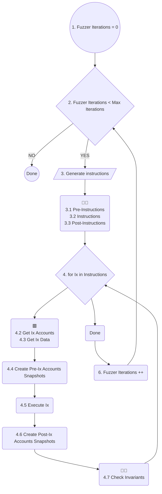

In the sequence diagram below you can see a simplified fuzz test lifecycle.

Some diagram states are labeled with emojis:

- 🟥 Mandatory methods that must be implemented by the user.
- 👩‍💻 Optional methods that can be implemented by the user.

## Lifecycle

1.  The fuzzer is running until:
    1. The maximal number of iterations is reached (if specified).
    2. A crash was detected and the `exit_upon_crash` parameter was set.
    3. User interrupted the test manually (for example by hitting `CTRL+C`).
2. In each iteration, the fuzzer generates a sequence of random instructions to execute.
    1. User can optionally customize how the instructions are generated and can specify the instructions that should be executed at the beginning (`pre_ixs`), in the middle (`ixs`) and at the end (`post_ixs`) of each iteration. This can be useful for example if your program needs an initialization or you want to fuzz some specific program state.
3. For each instruction:
    1. User defined mandatory method `get_accounts()` is called to collect necessary instruction accounts.
    2. User defined mandatory method `get_data()` is called to collect instruction data.
    3. A snapshot of all instruction accounts before the instruction execution is saved.
    4. The instruction is executed.
    5. A snapshot of all instruction accounts after the instruction execution is saved.
    6. User defined optional method `check()` is called to check accounts data and evaluate invariants.

<!-- https://mermaid.js.org/intro/ -->

