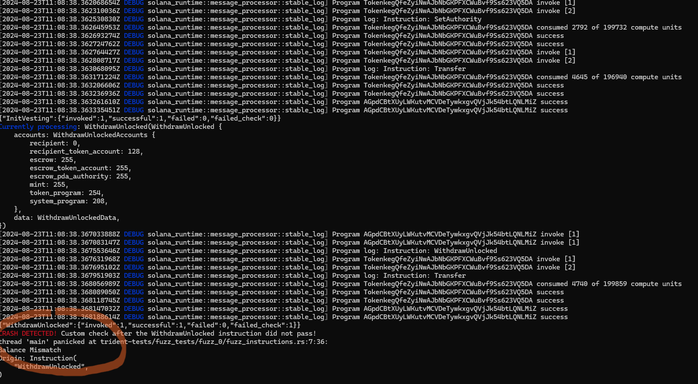

---
hide:
  - navigation
---

## Initialization

### Initialize Fuzz Test

Initialize Trident in the Anchor-based workspace.

```bash
trident init
```

!!! info

    Trident under the hood

    - Builds the Anchor-based project.
    - Reads the generated IDL.
    - Based on the IDL creates the fuzzing template.

### Add new Fuzz Test

!!! info

    This step is optional, `trident init` will generate the first fuzz test template. Use `trident fuzz add` in case you want to add additional Template.

Add new Fuzz Test if Trident is already initialized.

```bash
trident fuzz add
```


## Fill the Fuzz test Template


### Derive AccountsSnapshots

In the `Cargo.toml` file of each of the Anchor-based program within the workspace, define the required dependencies and feature as shown in the example below.

!!! important

    Please pay attention only to the:

    - `trident-fuzzing = ["dep:trident-fuzz"]`.
    - `trident-derive-accounts-snapshots = "version goes here"`.
    - `trident-fuzz = { version = "version goes here", optional = true }`.
    - If you are unsure what versions to use check the [Supported Versions](../installation/installation.md/#supported-versions).

!!! tip

    The feature `trident-fuzzing = ["dep:trident-fuzz"]` ensures that the `AccountsSnapshots` are used only with the Trident.

```toml
[package]
name = "..."
version = "0.1.0"
description = "Created with Anchor"
edition = "2021"

[lib]
crate-type = ["cdylib", "lib"]
name = "..."

[features]
default = []
cpi = ["no-entrypoint"]
no-entrypoint = []
no-idl = []
no-log-ix-name = []
idl-build = ["anchor-lang/idl-build"]
trident-fuzzing = ["dep:trident-fuzz"] # !!!!

[dependencies]
trident-derive-accounts-snapshots = "version goes here" # !!!!
trident-fuzz = { version = "version goes here", optional = true } # !!!!


# ...
```

For every Account Context specified in the Anchor project derive `AccountsSnapshots` such as:

```rust
// ...

use trident_derive_accounts_snapshots::AccountsSnapshots;

// ...


#[derive(Accounts, AccountsSnapshots)]
pub struct InitializeContext<'info> {
    #[account(mut)]
    pub author: Signer<'info>,
    #[account(
        init,
        payer=author,
        space=8+100,
        seeds=[b"hello_world_seed"],
        bump
    )]
    pub hello_world_account: Account<'info, StoreHelloWorld>,
    pub system_program: Program<'info, System>,
    // ...

}

```

### Link the AccountsSnapshots

Fuzz Instructions use the derived `AccountsSnapshots`. In this case we need to link the derived `AccountsSnapshots` to the corresponding aliases.

!!! important

    Modules where the Contexts (with the derived AccountsSnapshots) are specified need to be public.

```rust
// fuzz_instructions.rs

use hello_world::trident_fuzz_initialize_context_snapshot::InitializeContextAlias;

type InitializeFnSnapshot<'info> = InitializeContextAlias<'info>;

```

!!! tip

    For more examples, check the [Examples](../examples/examples.md).

### Define Fuzz Accounts

Define `AccountsStorage` type for each Account you would like to use.

!!! important

    Keep in mind:

    - You do not need to specify every `AccountStorage`, some accounts do not necessarily need to be stored in their corresponding storage.
        - For example `System Program` does not need to be stored, rather can be used from the `solana_sdk`.
    - If you are about to Initialize `Mint` or `Token Account` in your Solana Program.
        - use `Keypair` or `PdaStore` (not `MintStore` or `TokenStore`).
    - If you are going to initialize `Associated Token Account` in your Solana Program.
        - use `PdaStore`.
    - You can rename `FuzzAccounts` fields to whatever you want. The default names were generated based on the Program's `IDL`.

```rust
#[doc = r" Use AccountsStorage<T> where T can be one of:"]
#[doc = r" Keypair, PdaStore, TokenStore, MintStore, ProgramStore"]
#[derive(Default)]
pub struct FuzzAccounts {
    author: AccountsStorage<Keypair>,
    hello_world_account: AccountsStorage<PdaStore>,
    // No need to fuzz system_program
    // system_program: AccountsStorage<todo!()>,
}
```

!!! tip

    For more details about the `AccountsStorage` check [AccountsStorage](../features/account-storages.md).

### Implement Fuzz Instructions

Each Instruction in the Fuzz Test has to have defined the following functions:

- `get_program_id()`
    - Specifies to which program the Instruction belongs. This function is **automatically defined** and should not need any updates. The importance is such that if you have multiple programs in your workspace, Trident can generate Instruction Sequences of Instruction corresponding to different programs.
- `get_data()`
    - Specifies what Instruction inputs are send to the Program Instructions.
- `get_accounts()`
    - Specifies what Accounts are send to the Program Instructions.

!!! tip

    - For more info about how to write these functions, check the [Fuzz Instructions](../features/fuzz-instructions.md).
    - For the examples how to write these functions, check the [Examples](../examples/examples.md).


## Execute

### Run Fuzz Test

To execute the desired fuzz test, run:

```bash
# Replace <TARGET_NAME> with the name of particular
# fuzz test (for example: "fuzz_0")
trident fuzz run <TARGET_NAME>
```

!!! important

    The output provided by Honggfuzz is as follows:

    1. Number of Fuzzing Iterations.
    2. Feedback Driven Mode = Honggfuzz generates data based on the feedback (i.e. feedback based on Coverage progress).
    3. Average Iterations per second.
    4. Number of crashes it found (**panics** or failed **invariant checks**).


```bash
------------------------[  0 days 00 hrs 00 mins 01 secs ]----------------------
  Iterations : 688 (out of: 1000 [68%]) # -- 1. --
  Mode [3/3] : Feedback Driven Mode # -- 2. --
      Target : trident-tests/fuzz_tests/fuzzing.....wn-linux-gnu/release/fuzz_0
     Threads : 16, CPUs: 32, CPU%: 1262% [39%/CPU]
       Speed : 680/sec [avg: 688] # -- 3. --
     Crashes : 1 [unique: 1, blocklist: 0, verified: 0] # -- 4. --
    Timeouts : 0 [10 sec]
 Corpus Size : 98, max: 1048576 bytes, init: 0 files
  Cov Update : 0 days 00 hrs 00 mins 00 secs ago
    Coverage : edge: 10345/882951 [1%] pc: 163 cmp: 622547
---------------------------------- [ LOGS ] ------------------/ honggfuzz 2.6 /-
```

### Debug Fuzz Test

To debug your program with values from a crash file:

```bash
# fuzzer will run the <TARGET_NAME> with the specified <CRASH_FILE_PATH>
trident fuzz run-debug <TARGET_NAME> <CRASH_FILE_PATH>
```

!!! tip

    By default, the crashfiles are stored in the `trident-tests/fuzz_tests/fuzzing/hfuzz_workspace/<FUZZ_TARGET>`.


!!! important

    The debug output is at current development stage really verbose and contains lldb parts. We are working on improving this experience. In the picture below you can see an example of provided debug output.

    1. Series of Transaction Logs
    2. Structures of data send within the Instructions
    3. **Panic** or **Crash**, based on if the Fuzzing panicked within the Solana Program or Invariant Check failed.



